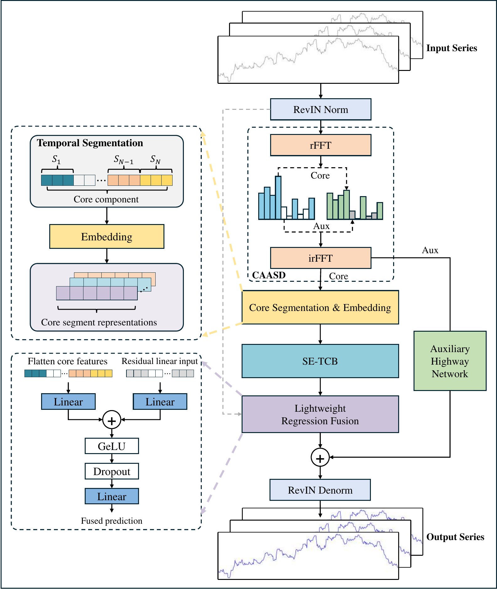

# SECNet: Spectral Enhancement Core-Auxiliary Network for Long-Term Multivariate Time Series Forecasting

[](LICENSE)

This repository provides the **official implementation** of **SECNet**.



---

## Project Structure

```text
SECNet/
├── run.py                          # Main entry point
├── run_SECNet_datasets.sh          # Unified runner for all seven datasets
├── scripts/                        # Dataset-specific experiment scripts
│   ├── SECNet_Exchange.sh
│   ├── SECNet_ETTh1.sh
│   ├── SECNet_ETTh2.sh
│   ├── SECNet_ETTm1.sh
│   ├── SECNet_ETTm2.sh
│   ├── SECNet_Flight.sh
│   └── SECNet_Weather.sh
├── models/
│   └── SECNet.py                   # SECNet architecture
├── layers/
│   └── RevIN.py                    # Reversible instance normalization
├── exp/
│   ├── exp_basic.py                # Base experiment class
│   └── exp_long_term_forecasting.py # Training and evaluation pipeline
├── data_provider/
│   ├── data_factory.py             # Dataset and dataloader builder
│   └── data_loader.py              # Forecasting dataset loaders
├── utils/                          # Metrics, logging, and time features
├── dataset/                        # Included benchmark CSV files
├── checkpoints/                    # Saved model checkpoints
├── results/                        # Saved predictions and metrics
├── logs/                           # Run logs and summary files
├── LICENSE                         # MIT license
├── requirements.txt                # Python dependencies except PyTorch
└── README.md                       # Project documentation
```

## Environment

The experiments were run with the following environment:

- Python `3.11.15`
- PyTorch `2.6.0+cu124`
- CUDA `12.4`

Create and activate the conda environment first:

```bash
conda create -n secnet python=3.11.15 -y
conda activate secnet
```

Then install PyTorch and the remaining Python packages:

```bash
pip install torch==2.6.0 --index-url https://download.pytorch.org/whl/cu124
pip install -r requirements.txt
```

## Quick Start

### Run all seven datasets

Use the unified runner:

```bash
bash run_SECNet_datasets.sh
```

This command uses `GPU 0` by default. You can also specify the GPU explicitly:

```bash
GPUS="0" bash run_SECNet_datasets.sh
```

You can also use multiple GPUs. The runner assigns dataset scripts to GPUs automatically:

```bash
GPUS="0,1" bash run_SECNet_datasets.sh
```

Outputs:

- A timestamped log directory will be created under `logs/long_term_forecast/SECNet/<timestamp>/`.
- This directory contains dataset-specific log files such as `ETTh1.log` and `Exchange.log`.
- A parsed summary file `summary.csv` will also be generated in the same log directory.
- Model checkpoints are saved under `checkpoints/`.
- Prediction arrays and metrics are saved under `results/`.
- Metrics are also appended to `result_long_term_forecast.txt`.

### Run a single dataset

Examples:

```bash
bash scripts/SECNet_ETTh1.sh
bash scripts/SECNet_ETTm2.sh
bash scripts/SECNet_Exchange.sh
```

Outputs:

- The script prints training and testing logs directly to the current terminal.
- Model checkpoints are saved under `checkpoints/`.
- Prediction arrays and metrics are saved under `results/`.
- Metrics are also appended to `result_long_term_forecast.txt`.
- Unlike `run_SECNet_datasets.sh`, no timestamped `logs/.../summary.csv` log bundle is created automatically.

